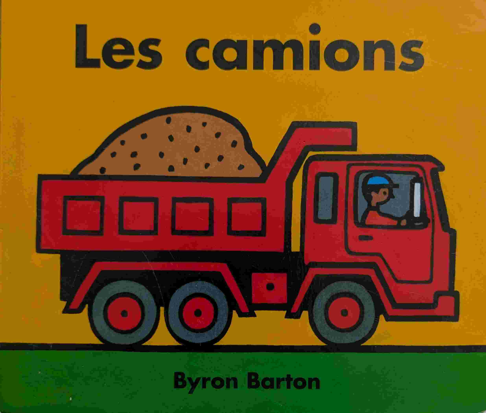
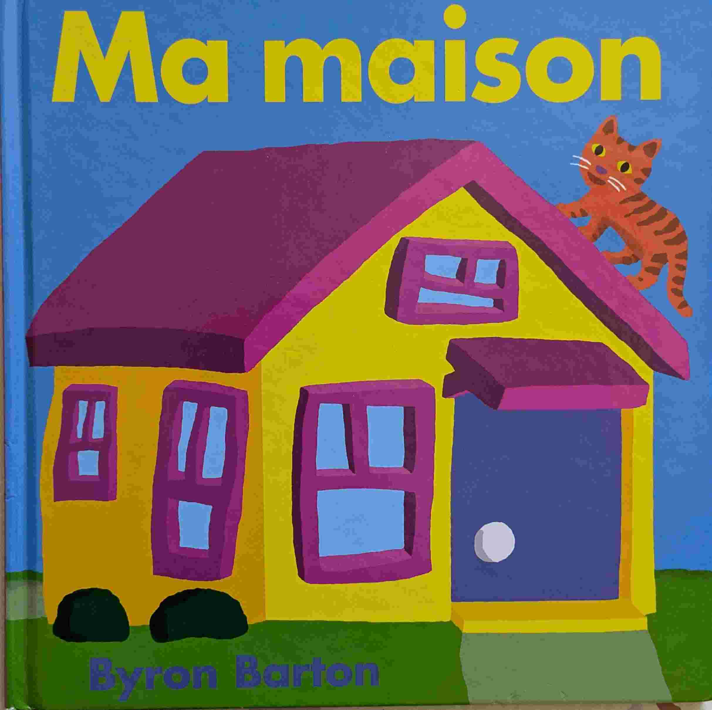
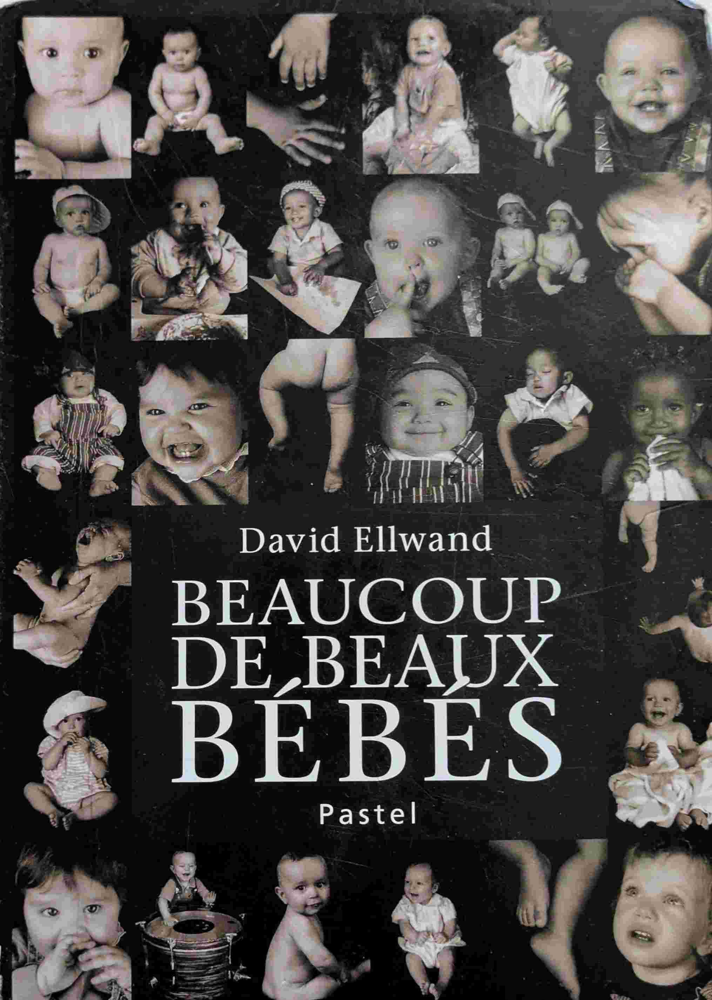

# 0-1 ans

## Introduction
Des livres pour les tout-petits.

## Les camions (*Byron Barton*)

{ width="100" }

Des illustrations minimalistes très bien pour les tout petits.

## Ma maison (*Byron Barton*)

{ width="100" }

Des illustrations minimalistes très bien pour les tout petits.

## Beaucoup de beaux bébés (*David Ellwand*)

{ width="100" }

Des photos de bébés. Un livre pour les tout-tout-petits.

## Un livre (*Hervé Tullet*)

{ width="100" }

Un livre super interactif pour apprendre couleur, formes et espace. Merci Justine !

Prix Sorcière 2011 (Catégorie tout-petits)  

## Le lion et la souris (*Jerry Pinkney*)

{ width="100" }

La fable d'Ésope illustrée par Jerry Pinkney, sans texte. De très belles illustrations et une morale qui traverse les millénaires.

## Au bain petit lapin (*Jörg Mühle*)

{ width="100" }

Une histoire courte, simple, ludique et efficace pour les petits.

## Au lit petit lapin (*Jörg Mühle*)

{ width="100" }

Une histoire douce et apaisante pour l'heure du coucher.

## On joue, Petit Lapin! (*Jörg Mühle*)

{ width="100" }

De belles illustrations, des mini-histoires rigolotes. Un final qui fait toujours rire même à la dixième lecture. Simple mais efficace.

## Au bois dormant (*Karen Jameson et Marc Boutavant*)

{ width="100" }

Un livre sur les animaux avant de dormir.

## 2 petites mains et 2 petits pieds (*Mem Fox et Helen Oxenbury*)

{ width="100" }

Un livre sur la diversité des bébés.

