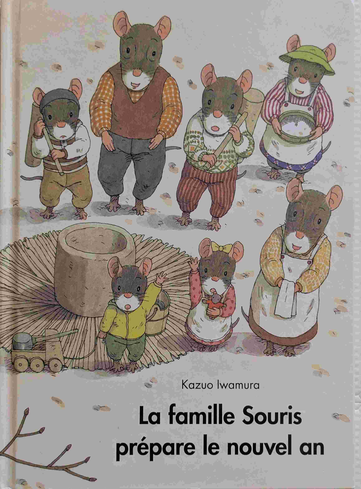
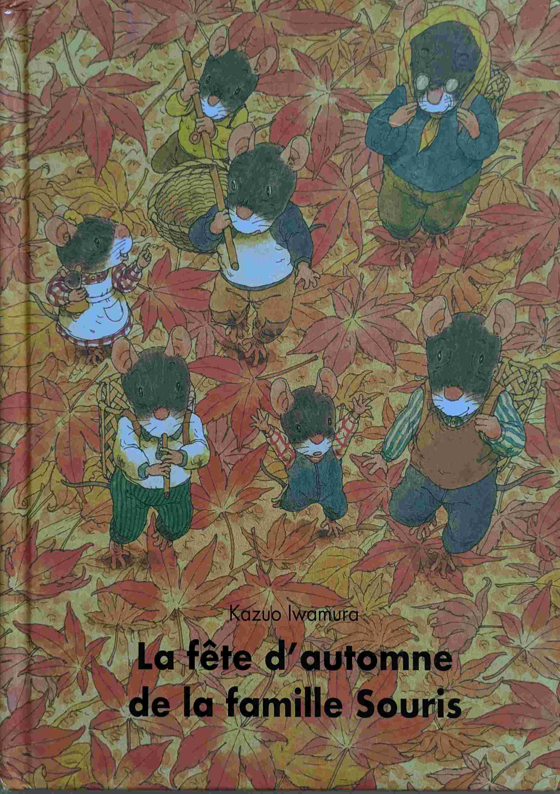

# Kazuo Iwamura

## Introduction
Kazuo Iwamura est un auteur et illustrateur japonais, reconnu pour ses livres pour enfants qui mettent en avant la nature et les relations humaines.

## L'hiver de la famille souris (*Kazuo Iwamura*)

{ width="100" }

#todo

## La famille souris dîne au clair de lune (*Kazuo Iwamura*)

{ width="100" }

Un livre sur les liens familiaux et la nature.

## La famille souris et la racine geante (*Kazuo Iwamura*)

{ width="100" }

Une histoire sur la nature.

## À table (*Kazuo Iwamura*)

{ width="100" }

Les oiseaux ne mangent pas la même chose que les écureuils.

## C'est déjà le Printemps! (*Kazuo Iwamura*)

{ width="100" }

Que devient la neige au Printemps? Une très belle histoire, beaucoup de poésie, et une très belle rencontre au milieu du lac.

## Vive la neige (*Kazuo Iwamura*)

{ width="100" }

Un peu de neige, c'est l'occasion idéale pour sortir la luge et permettre aux adultes de retrouver une âme d'enfants.

## Le pique-nique de la famille Souris (*Kazuo Iwamura*)

{ width="100" }

Tour est dans le titre.

## La famille Souris et le potiron (*Kazuo Iwamura*)

{ width="100" }

#todo

## La famille souris prépare le nouvel an (*Kazuo Iwamura*)

{ width="100" }

#todo

## La fête d'automne de la famille souris (*Kazuo Iwamura*)

{ width="100" }

#todo

## La lessive de la famille souris (*Kazuo Iwamura*)

{ width="100" }

#todo

## Le train des souris (*Kazuo Iwamura*)

{ width="100" }

Pour motiver les souris pour la rentrée des classes, la maman souris a une idée: suggérer des rails jusqu'à l'école. Mais le chemin est semé d'embûches. 

