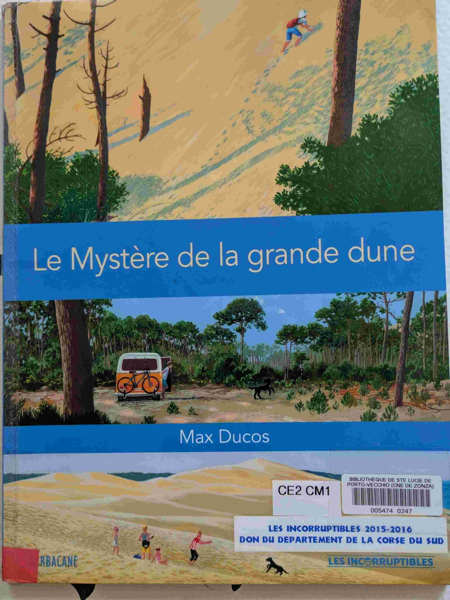
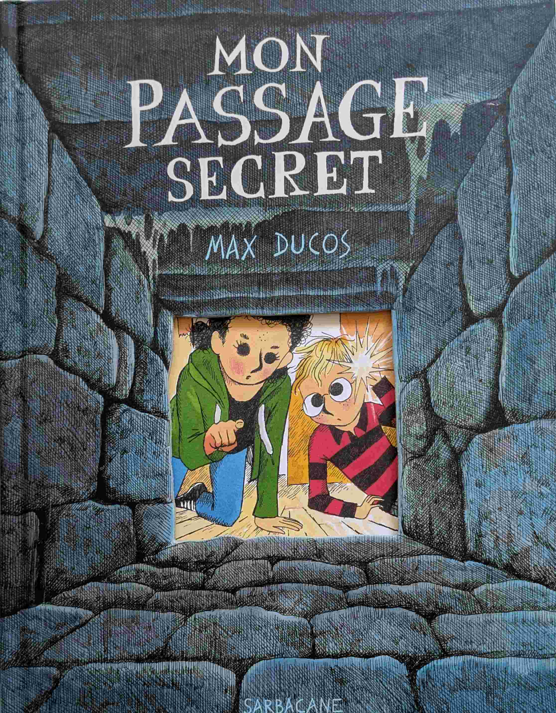

# Max Ducos

## Introduction
Max Ducos écrit des histoires dont les scénarios sont à la fois très imaginatifs, poétiques, et profonds, mais avec un récit toujours très simple et efficace. Tout ça avec de très belles illustrations. Super à partir de 3 ans. 

## Jeu de pist à Volubilis (*Max Ducos*)

{ width="100" }

Un jeu de piste captivant dans dans une maison d'architecte. Un scénario complexe mais qui se suit bien par les enfants.

## L'ange disparu (*Max Ducos*)

{ width="100" }

Une visite au musée qui sort de l'ordinaire. 

## Le Carnaval des dragons (*Max Ducos*)

{ width="100" }

Comment transormer un échec en succès. 

## Le mystère de la grande dune (*Max Ducos*)

{ width="100" }

Un petit garçon s'aventure sur la dune du Pyla, et trouve un dauphin échoué suite à une tempête. Un scénario captivant pour les enfants, avec de très belles illustrations. 

## Mon passage secret (*Max Ducos*)

{ width="100" }

Un papy essaye de se souvenir d'un passage secret de son enfance. Mais papy sucre un peu les fraises. Mais on rigole bien !

## Vert secret (*Max Ducos*)

{ width="100" }

Du grand Max Ducos qui offre là une histoire complexe et captivante. Un scénario super pour les enfants, servi avec de belles illustrations.

