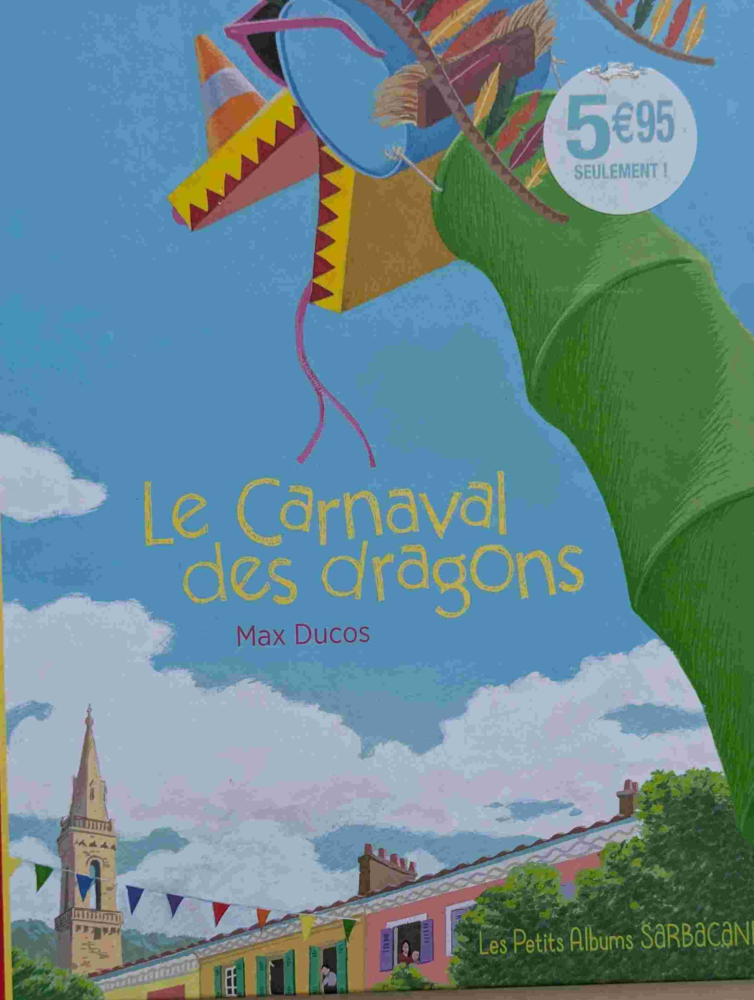

# Max Ducos

## Introduction
Max Ducos écrit des histoires dont les scénarios sont à la fois très imaginatifs, poétiques, et profonds,mais avec un récit toujours très simple et efficace. Tout ça avec de très belles illustrations. Super à partir de 3 ans.

## L'ange disparu (*Max Ducos*)

{ width="100" }

Une visite au musée qui sort de l'ordinaire. 

## Le Carnaval des dragons (*Max Ducos*)

{ width="100" }

to be filled

## Vert secret (*Max Ducos*)

{ width="100" }

to be filled

## Jeu de pist à Volubilis (*Max Ducos*)

{ width="100" }

to be filled

