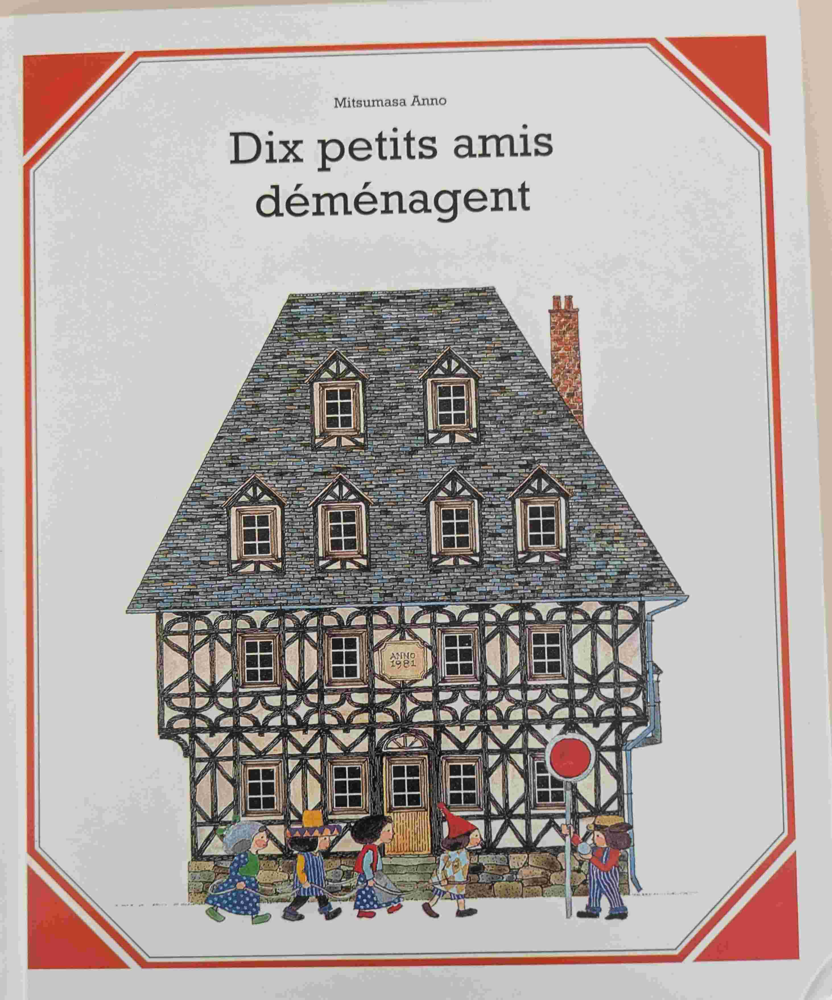
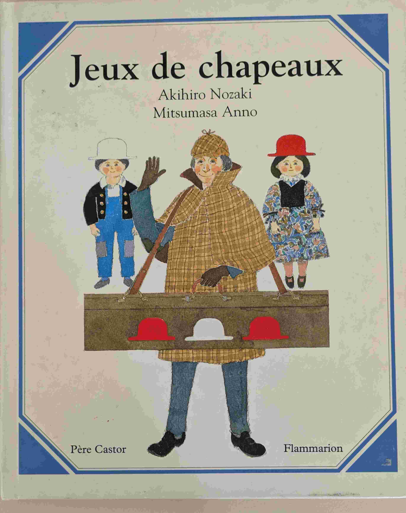
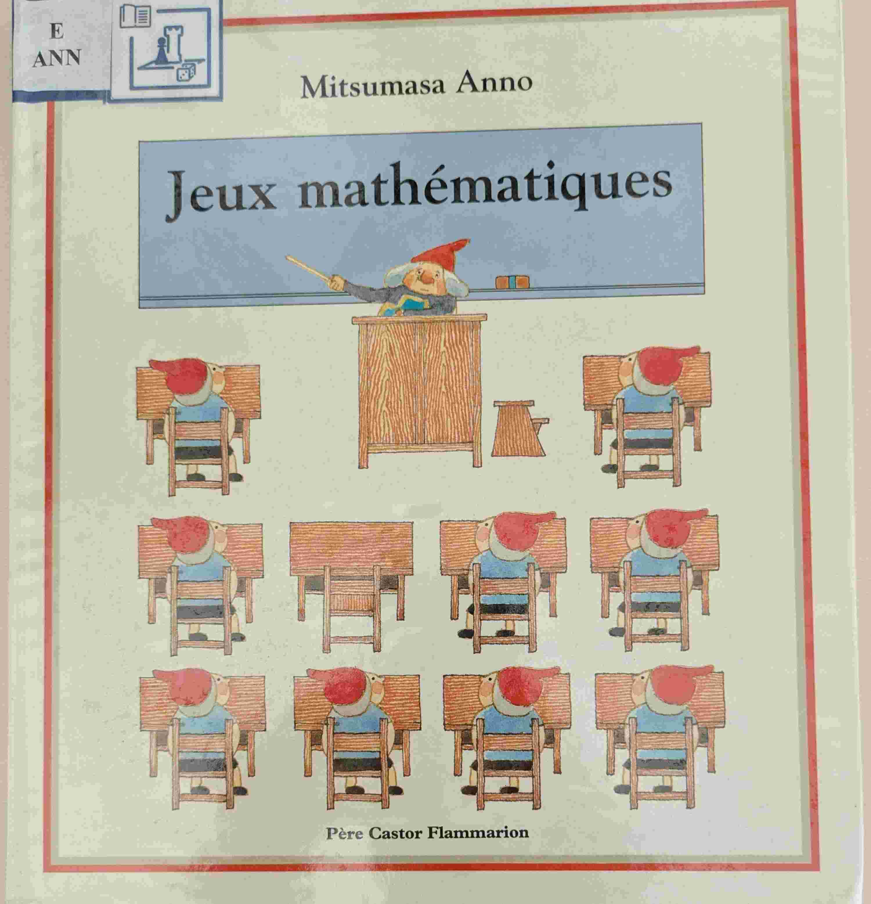
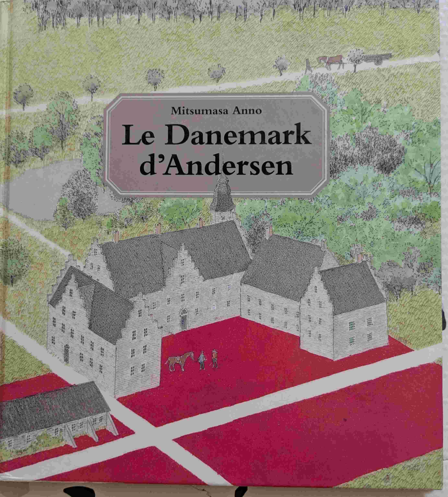
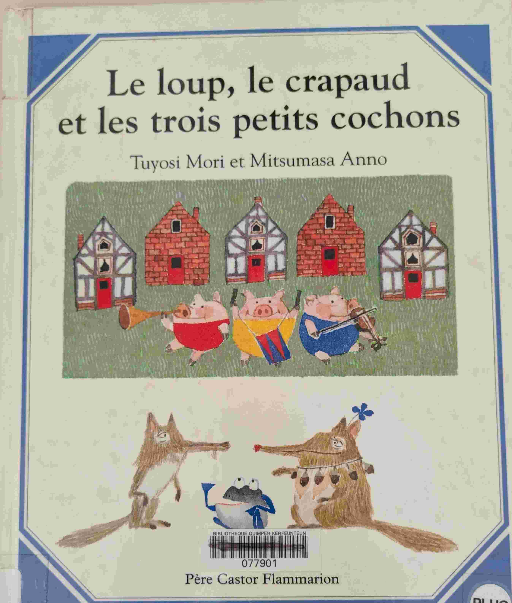
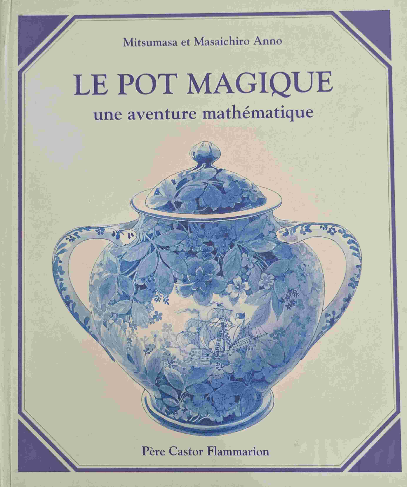
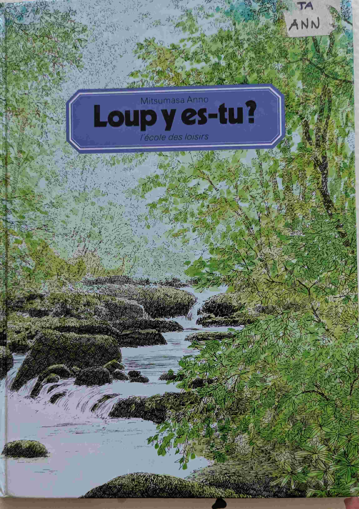

# Mitsumasa Anno

## Introduction
Mitsumasa Anno est un auteur et illustrateur japonais, célèbre pour ses livres pour enfants qui explorent des thèmes de la nature, du voyage, de l'art et des mathématiques. Mitsumasa Anno est également connu pour son approche unique de la narration visuelle, incitant les jeunes lecteurs à interagir avec les illustrations et à découvrir des histoires cachées. 

## Ce jour-là... (*Mitsumasa Anno*)

{ width="100" }

Un voyage initiatique à travers l'Europe des siècles passés. Beaucoup de détails. Beaucoup de références artistiques qui m'échappent, mais il y a des explications à la fin.

## Dix petits amis déménagent (*Mitsumasa Anno*)

{ width="100" }

Un super livre pour une introduction en douceur au concept de soustraction (table de 10).

## Jeux de chapeaux (*Mitsumasa Anno*)

{ width="100" }

Une introduction aux maths.

## Jeux mathématiques (*Mitsumasa Anno*)

{ width="100" }

Une introduction aux maths. Tout en douceur .

## Le Danemark d'Anderson (*Mitsumasa Anno*)

{ width="100" }

Un voyage à travers le Danemark, en suivant les traces d'Andersen.

## Le loup, le crapaud et les trois petits cochons (*Mitsumasa Anno*)

{ width="100" }

Une introduction aux maths.

## Le pot magique (*Mitsumasa Anno*)

{ width="100" }

Expliquer le concept de factorielle avec des dessins. Pas sûr que ça marche. Mais c'est déjà beau d'essayer !

## Loup y es-tu? (*Mitsumasa Anno*)

{ width="100" }

Des illustrations d'un bois. Dans chaque page des animaux ou des visages se cachent dans les dessins. Enfants captivés !

## Sur les traces de Don Quichotte (*Mitsumasa Anno*)

{ width="100" }

Même principe que 'ce jour-là...' en zoomant sur l'Espagne.

## Zwergenspuk (*Mitsumasa Anno*)

{ width="100" }

Un style très Escher. Avec plusieurs niveaux de compréhension. Unique dans son genre.

Prix Bologna Ragazzi 1972 (Mention spéciale pour les enfants)  

