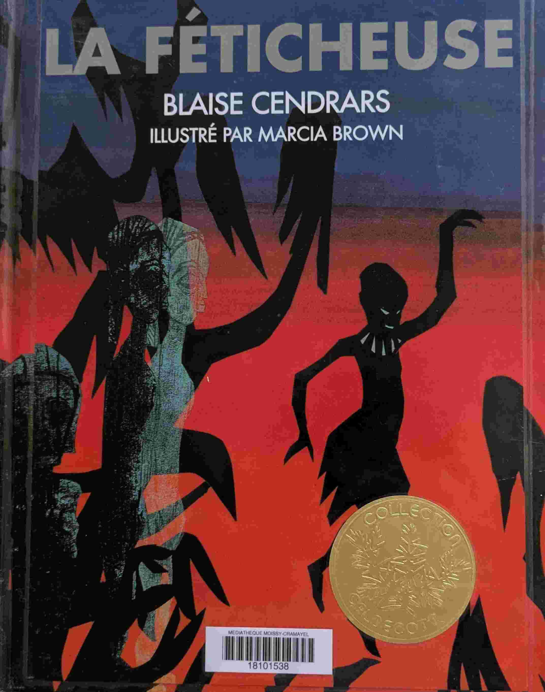
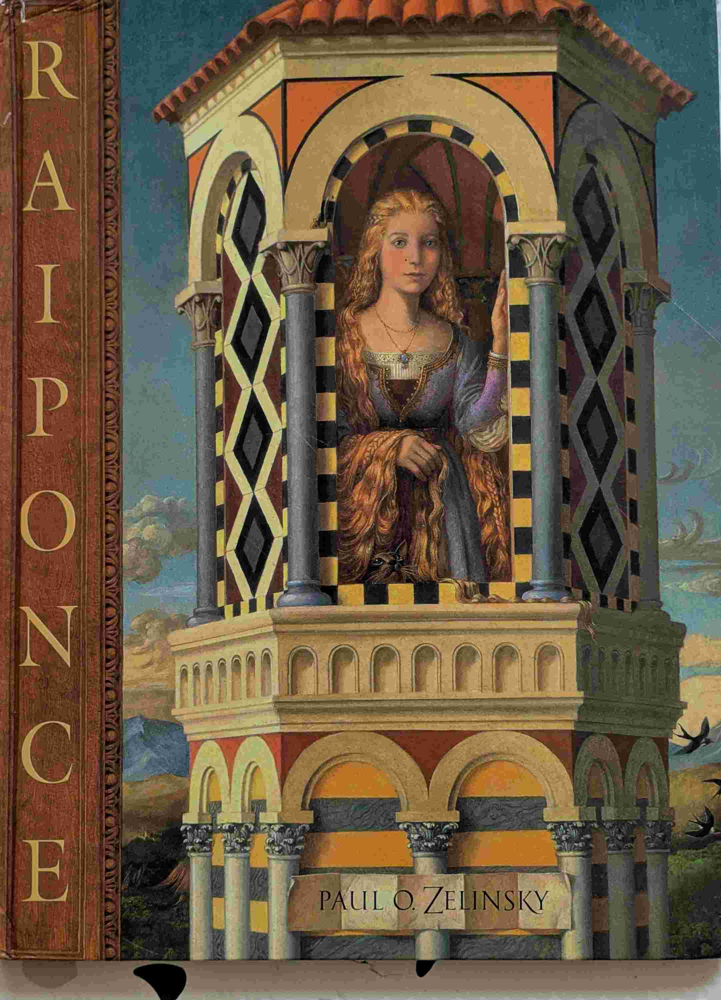

# Médaille Caldecott

## Introduction
La médaille Caldecott est décernée chaque année par l'American Library Association à l'illustrateur du livre d'images pour enfants américain le plus distingué de l'année.

## Voyage | Quest | Imagine, encore... (*Aaron Becker*)

{ width="100" }
{ width="100" }
{ width="100" }

Une trilogie très originale qui suit les aventures d'une petite fille dans un mondes imaginaire.À l'aide de son crayon, elle crée des objets, des outils, des animaux qui lui permet d'avancer dans son aventure.Bien qu'il n'y ait pas de texte, dans chaque livre le scénario est très bien ficelé et captivant pour les enfants.C'est la petite fille qui mène l'action. C'est elle qui sauve le roi. Et c'est elle qui a la curiosité d'initier l'histoire qui nous est racontée.

Médaille Caldecott 2014 (Finaliste)  

## Boréal-Express (*Chris Van Allsburg*)

{ width="100" }

La nuit de Noël. Un petit garçon.Un train sorti de nulle part. La vraie magie de Noël.

Médaille Caldecott 1986 (Gagnant)  

## Chute libre (*David Wiesner*)

{ width="100" }

Comme toujours avec Davide Wiesner, beaucoup de poésie et de créativité. Un garçon s'endort avec un livre dans les bras, et qu'on suit dans ses rêves. À couper le souffle.

Médaille Caldecott 1989 (Finaliste)  

## Le monde englouti (*David Wiesner*)

{ width="100" }

Un garçon, une plage, une vague, un appareil photo. David Wiesner a le don pour transformer la banalité en quelque chose d'extraordinaire. Je ne sais pas si David Wiesner (qui est Américain) avait en tête le poème de Rimbaud *Le bateau ivre* en dessinant les dernières pages. Mais le parallèle est saisissant. Un livre époustouflant. 
Les esprits cartésiens qui ont à coeur de distinguer une suite arithmétique d'une suite géométrique tiqueront sûrement dans un des passages clés du livre. Mais on pardonne volontiers à David. Merci David Wiesner pour ce chef-d'œuvre !

Médaille Caldecott 2007 (Gagnant)  

## Mardi (*David Wiesner*)

{ width="100" }

Un livre sur un mardi pas comme les autres.

Médaille Caldecott 1992 (Gagnant)  

## Juliette et Bellini (*Emily Arnold McCully*)

{ width="100" }

Juliette est une petite fille curieuse, courageuse, persévérante et émouvante. Quand elle fait la rencontre du célebre finambule Bellini, elle est tout de suite fascinée par son art. À force de détermination, elle finit par attitrer l'attention de Bellini qui l'entraîne. Spoiler: Et le jour où Bellini se retrouve en difficulté sur le fil, en pleine nuit et dans le vide, c'est Juliette qui vient le sauver et nour offre une dernière page sous les étoiles à couper le souffle. Go Juliette! Un livre magnifique.

Médaille Caldecott 1993 (Gagnant)  

## Le lion et la souris (*Jerry Pinkney*)

{ width="100" }

La fable d'Ésope illustrée par Jerry Pinkney, sans texte. De très belles illustrations et une morale qui traverse les millénaires.

Médaille Caldecott 2010 (Gagnant)  

## La féticheuse (*Marcia Brown*)

{ width="100" }

Illustrations d'un poème de Blaise Cendrars

Médaille Caldecott 1950 (Gagnant)  

## Max et les Maximonstres (*Maurice Sendak*)

{ width="100" }

Un classique de la littérature enfantine, qui aborde les thèmes de l'imagination et de la rébellion.

Médaille Caldecott 1964  

## Grigrigredinmenufretin (*Paul Zelinsky*)

{ width="100" }

Les livres de Paul Zelinksy sont des oeuvres d'art.La narration de l'histoire des frères Grimm n'est pas très moderne, mais les illustrations de Zelinksy sont magnifiques et plaisent aux enfants.

Médaille Caldecott 1987 (Finaliste)  

## Raiponce (*Paul Zelinsky*)

{ width="100" }

Chaque page ressemble à une peinture de maître de la Renaissance. C'est très beau. Et les enfants aiment beaucoup.

Médaille Caldecott 1998 (Gagnant)  

