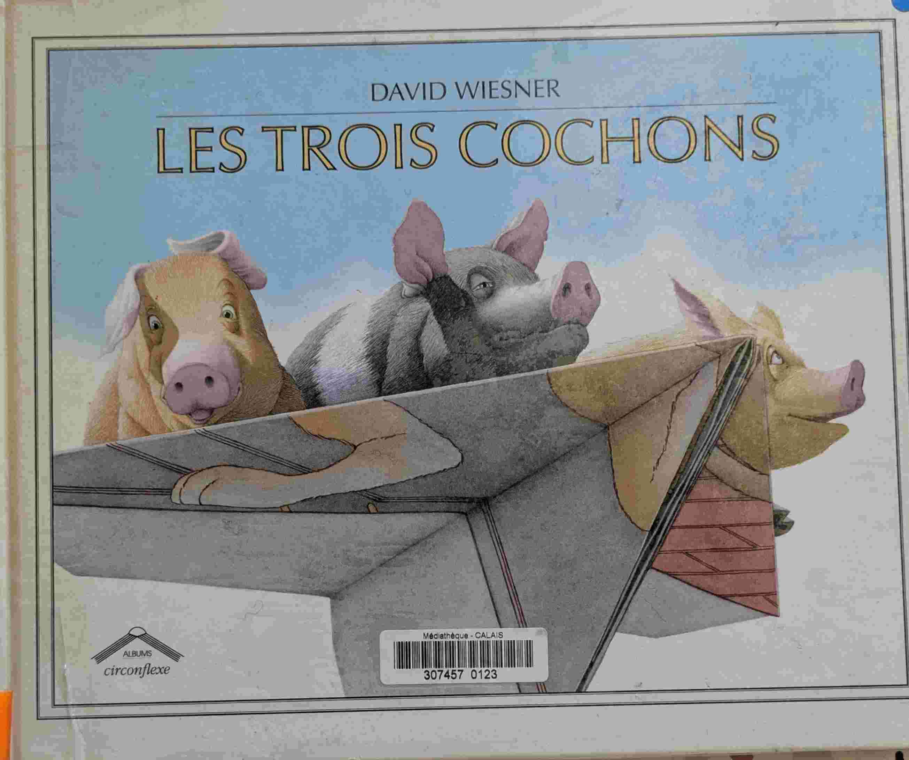
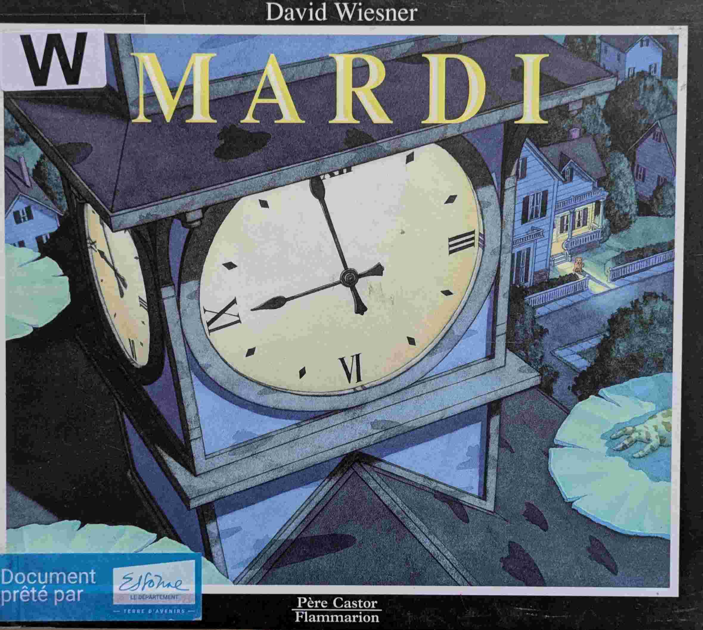
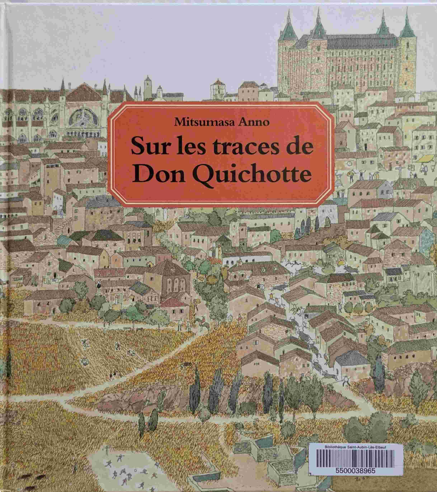

# Livres sans texte

## Introduction
Des livres sans texte, avec seulement des images, pour stimuler l'imagination.

## The tree and the River (*Aaron Becker*)

{ width="100" }

Une histoire sur le temps qui passe et son effet sur les paysages, les villes et les hommes.

## Voyage | Quest | Imagine, encore... (*Aaron Becker*)

{ width="100" }
{ width="100" }
{ width="100" }

Une trilogie très originale qui suit les aventures d'une petite fille dans un mondes imaginaire.À l'aide de son crayon, elle crée des objets, des outils, des animaux qui lui permet d'avancer dans son aventure.Bien qu'il n'y ait pas de texte, dans chaque livre le scénario est très bien ficelé et captivant pour les enfants.C'est la petite fille qui mène l'action. C'est elle qui sauve le roi. Et c'est elle qui a la curiosité d'initier l'histoire qui nous est racontée.

## La Rumeur de Venise (*Albertine et Germano Zullo*)

{ width="100" }

Un livre sans texte, qui illustre comment la rumeur passe d'une maison à l'autre.Et tout ça en voyageant à travers Venise.

## Avant Après (*Anne-Margot Ramstein et Matthias Aregui*)

{ width="100" }

Jour - Nuit, bourgeon - Fleur, vache - lait, etc.

## Chute libre (*David Wiesner*)

{ width="100" }

Comme toujours avec Davide Wiesner, beaucoup de poésie et de créativité. Un garçon s'endort avec un livre dans les bras, et qu'on suit dans ses rêves. À couper le souffle.

## Le monde englouti (*David Wiesner*)

{ width="100" }

Un livre sur l'imagination et la créativité.

## Les trois cochons (*David Wiesner*)

{ width="100" }

Une réinterprétation imaginative du conte classique.

## Mardi (*David Wiesner*)

{ width="100" }

Un livre sur un mardi pas comme les autres.

## Le lion et la souris (*Jerry Pinkney*)

{ width="100" }

La fable d'Ésope illustrée par Jerry Pinkney, sans texte. De très belles illustrations et une morale qui traverse les millénaires.

## La visite (*Junko Nakamura*)

{ width="100" }

Des illustrations très très belles. Pas de texte, et une histoire qui laisse place à de nombreuses interprétations. Après 20 lectures, on ne se lasse pas.

## Ce jour-là... (*Mitsumasa Anno*)

{ width="100" }

Un voyage initiatique à travers l'Europe des siècles passés. Beaucoup de détails. Beaucoup de références artistiques qui m'échappent, mais il y a des explications à la fin.

## Sur les traces de Don Quichotte (*Mitsumasa Anno*)

{ width="100" }

Même principe que 'ce jour-là...' en zoomant sur l'Espagne.

## Zwergenspuk (*Mitsumasa Anno*)

{ width="100" }

Un style très Escher. Avec plusieurs niveaux de compréhension. Unique dans son genre.

## Le livre de l'été (*Rotraut Susanne Berner*)

{ width="100" }

Dans la série de Rotraut Susanne Berner. Des livres avec pleins de détails sur la vie quotidienne. Super pour discuter avec les enfants et les aider à développer leur language.

## La Vague (*Suzy Lee*)

{ width="100" }

Une petite fille, une plage, des vagues. Rira bien qui rira le dernier !

## Waar is de taart? (*Thé Tjong-Khing*)

{ width="100" }

Deux souris volent un gâteau d'anniversaire. Une course poursuite s'ensuit. Il y a plusieurs histoires en parallèle. C'est un super livre (sans texte), très interactif et qui permet de découvrir un nouveau détail à chaque lecture.Non édité en français, mais comme il n'y a pas de texte, peu importe la langue d'édition. Disponible par exemple en néerlandais et allemand.

