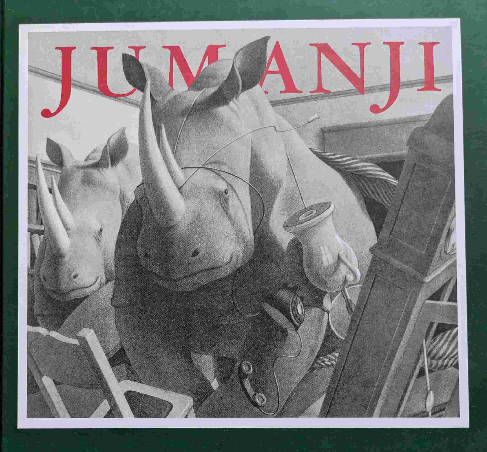
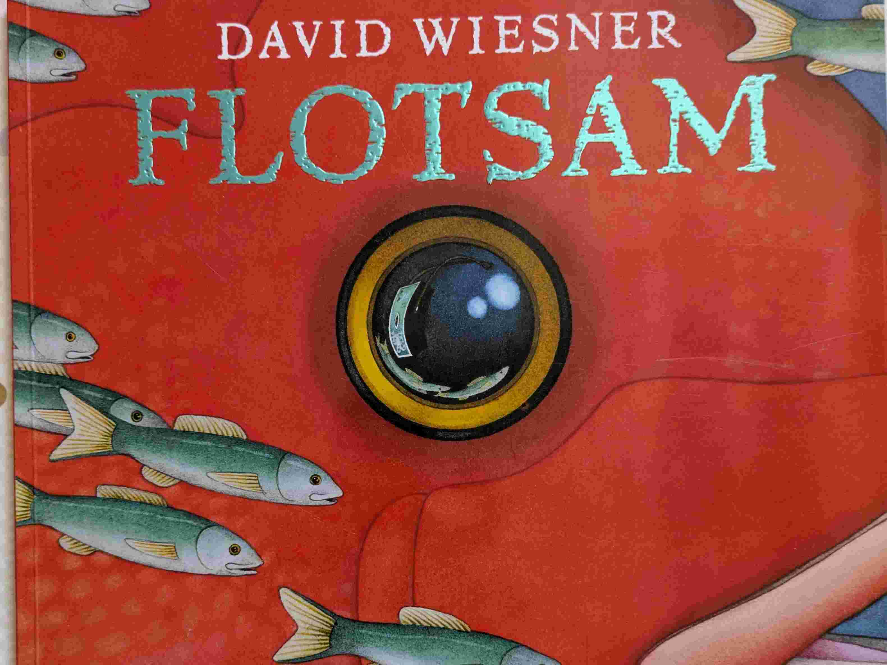

# Pour rêver

## Introduction
Des livres pour rêver et s'évader.

## Anna et le gorille (*Anthony Browne*)

{ width="100" }

Une petite fille, un anniversaire, un gorille.

## C'est toi le Printemps? (*Chiaki Okada et Ko Okada*)

{ width="100" }

Le benjamin des lapins entend beaucoup parler du printemps.Mais c'est quoi le Printemps? Un livre avec de belles illustrations pour découvrir cette saison.

## Boréal-Express (*Chris Van Allsburg*)

{ width="100" }

La nuit de Noël. Un petit garçon.Un train sorti de nulle part. La vraie magie de Noël.

## Jumanji (*Chris Van Allsburg*)

{ width="100" }

Un jeu de société qui prend vie. Le film est très populaire, mais le livre qui l'a inspiré mérite d'être redécouvert.

## Chute libre (*David Wiesner*)

{ width="100" }

Comme toujours avec Davide Wiesner, beaucoup de poésie et de créativité. Un garçon s'endort avec un livre dans les bras, et qu'on suit dans ses rêves. À couper le souffle.

## Le monde englouti (*David Wiesner*)

{ width="100" }

Un garçon, une plage, une vague, un appareil photo. David Wiesner a le don pour transformer la banalité en quelque chose d'extraordinaire. Je ne sais pas si David Wiesner (qui est Américain) avait en tête le poème de Rimbaud *Le bateau ivre* en dessinant les dernières pages. Mais le parallèle est saisissant. Un livre époustouflant. 
Les esprits cartésiens qui ont à coeur de distinguer une suite arithmétique d'une suite géométrique tiqueront sûrement dans un des passages clés du livre. Mais on pardonne volontiers à David. Merci David Wiesner pour ce chef-d'œuvre !

## Ligne 135 (*Germano Zullo et Albertine*)

{ width="100" }

Une petite fille voyage en train de la ville à la campagne et se questionne sur le sens de la vie. Avec des illustrations très belles, poétiques et créatives.

## La visite (*Junko Nakamura*)

{ width="100" }

Des illustrations très très belles. Pas de texte, et une histoire qui laisse place à de nombreuses interprétations. Après 20 lectures, on ne se lasse pas.

## Au bois dormant (*Karen Jameson et Marc Boutavant*)

{ width="100" }

Un livre sur les animaux avant de dormir.

## C'est déjà le Printemps! (*Kazuo Iwamura*)

{ width="100" }

Que devient la neige au Printemps? Une très belle histoire, beaucoup de poésie, et une très belle rencontre au milieu du lac.

## La famille souris dîne au clair de lune (*Kazuo Iwamura*)

{ width="100" }

Un livre sur les liens familiaux et la nature.

## Vive la neige (*Kazuo Iwamura*)

{ width="100" }

Un peu de neige, c'est l'occasion idéale pour sortir la luge et permettre aux adultes de retrouver une âme d'enfants.

## À table (*Kazuo Iwamura*)

{ width="100" }

Les oiseaux ne mangent pas la même chose que les écureuils.

## Max et les Maximonstres (*Maurice Sendak*)

{ width="100" }

Un classique de la littérature enfantine, qui aborde les thèmes de l'imagination et de la rébellion.

Médaille Caldecott 1964  

## L'ange disparu (*Max Ducos*)

{ width="100" }

Une visite au musée qui sort de l'ordinaire. 

