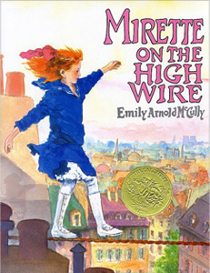
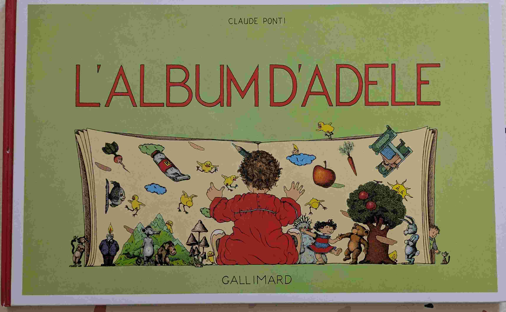

# Choisir c'est renoncer

## Introduction
Nous n'avons pas résisté à l'envie de vous présenter un top 10. Tout en subjectivité. 

## Le monde englouti (*David Wiesner*)

{ width="100" }

Un garçon, une plage, une vague, un appareil photo. David Wiesner a le don pour transformer la banalité en quelque chose d'extraordinaire. Je ne sais pas si David Wiesner (qui est Américain) avait en tête le poème de Rimbaud *Le bateau ivre* en dessinant les dernières pages. Mais le parallèle est saisissant. Un livre époustouflant. 
Les esprits cartésiens qui ont à coeur de distinguer une suite arithmétique d'une suite géométrique tiqueront sûrement dans un des passages clés du livre. Mais on pardonne volontiers à David. Merci David Wiesner pour ce chef-d'œuvre !

## Juliette et Bellini (*Emily Arnold McCully*)

{ width="100" }

Juliette est une petite fille curieuse, courageuse, persévérante et émouvante. Quand elle fait la rencontre du célebre finambule Bellini, elle est tout de suite fascinée par son art. À force de détermination, elle finit par attitrer l'attention de Bellini qui l'entraîne. Spoiler: Et le jour où Bellini se retrouve en difficulté sur le fil, en pleine nuit et dans le vide, c'est Juliette qui vient le sauver et nour offre une dernière page sous les étoiles à couper le souffle. Go Juliette! Un livre magnifique.

## La famille souris dîne au clair de lune (*Kazuo Iwamura*)

{ width="100" }

Un livre sur les liens familiaux et la nature.

## Grosse Légume (*Jean Gourounas*)

{ width="100" }

À mourir de rire. L'histoire d'un ver qui s'enfile des légumes. Attention, pour que le charme opère, il faut que le lecteur lise le livre de manière rythmique. Les kids en redemandent!

Prix Sorcière 2005 (Catégorie tout-petits)  

## La visite (*Junko Nakamura*)

{ width="100" }

Des illustrations très très belles. Pas de texte, et une histoire qui laisse place à de nombreuses interprétations. Après 20 lectures, on ne se lasse pas.

## Boréal-Express (*Chris Van Allsburg*)

{ width="100" }

La nuit de Noël. Un petit garçon.Un train sorti de nulle part. La vraie magie de Noël.

## Une histoire à quatre voix (*Anthony Browne*)

{ width="100" }

Une histoire racontée par quatre personnages différents, chacun avec sa propre perspective. Très drole, et offre une réflexion sur la subjectivité des points de vue. Les illustrations sont bourrées de détails en arrière-plan: à chaque lecture on découvre un nouveau détail. 

Prix Sorcière 1999 (Catégorie albums)  

## Vert secret (*Max Ducos*)

{ width="100" }

Du grand Max Ducos qui offre là une histoire complexe et captivante. Un scénario super pour les enfants, servi avec de belles illustrations.

## Avant Après (*Anne-Margot Ramstein et Matthias Aregui*)

{ width="100" }

Jour - Nuit, bourgeon - Fleur, vache - lait, etc.

Prix Bologna Ragazzi 2015 (non fiction, gagnant)  

## L'album d'Adèle (*Claude Ponti*)

{ width="100" }

Le premier volet de la série Adèle. Un livre sans image, où on découvre de nouveaux détails à chaque lecture. 

